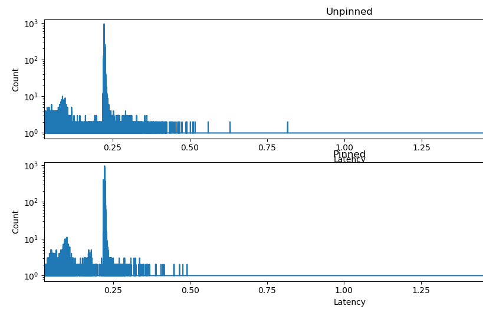

### Results

```
Test 1) Unpinned
Set core affinity for latency_worker 127581450262208 to -1
CPU migrations: 1638

Test 2) Pinned
Set core affinity for latency_worker_2 127581450262208 to 2
CPU migrations: 1
```

```
Unpinned:
p50:    222875
p99:    328380
p999:   1809723
Max:    24759042

Pinned:
p50:    222392
p99:    235025
p999:   702808
Max: 24797823
```



Pinning eliminates scheduler migrations and slightly reduces tail latency by avoiding cache cold starts
and runqueue contention.